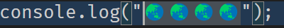
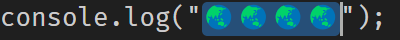

jump-easy


## ctrl+shift+j

You can use number + non-number + number to jump to a selection

- ```n```: Jump to the nth character
- ```a:b```: Jump to selection [a, b)


## unicode

```js
console.log("🆒🆒🆒🆒");
```

- 13
<div align="center">
	<a href="https://github.com/ahaoboy/ansi2">
		
	</a>
</div>

- 13:17

<div align="center">
	<a href="https://github.com/ahaoboy/ansi2">
		
	</a>
</div>